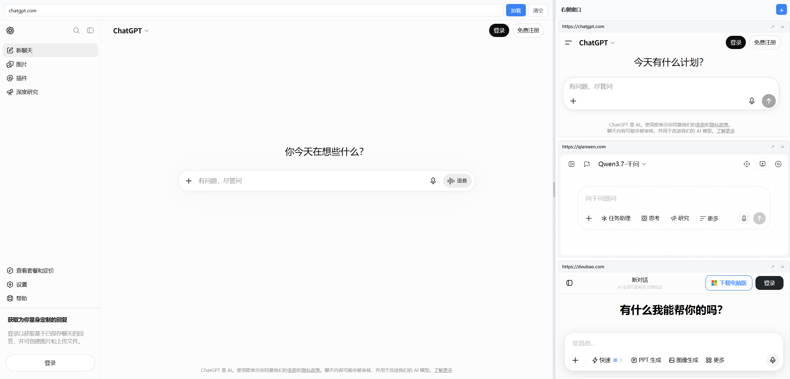
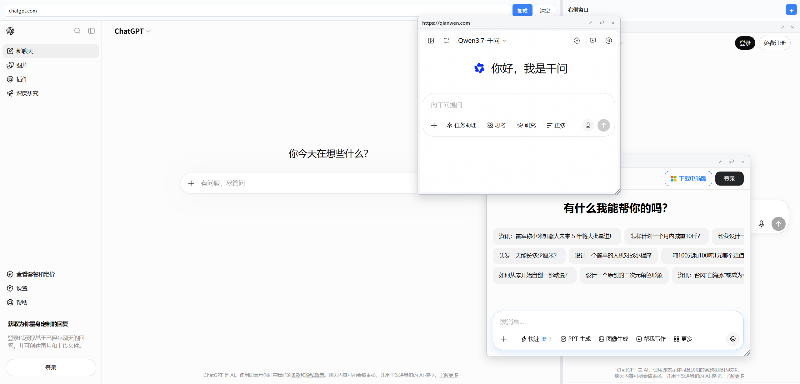

# 嵌入看板（Embedded Dashboard）

一款基于 Vue 3 + Vite 的多嵌入页面网页应用。左侧主窗口可加载任意网址，右侧面板可动态添加多个 iframe 小窗口，支持拖拽脱离布局、自由移动、调整大小、回归布局，左右比例可拖动调整。

## 截图预览

### 首页（home）



### 拖动后的效果（move）



## 解决的问题

在使用 AI 网页问答时，常会对某一个点产生疑问需要立即提问。本应用提供：

- **主窗口（左 70%）**：加载主网址（如 AI 问答页面），输入 URL 即可嵌入。
- **右侧小窗口面板（右 30%）**：点 `+` 添加任意网址作为参考小窗口，多窗口竖向按比例均分。
- **拖拽脱离**：按住某个右侧窗口的标题栏拖动，超过 4px 阈值后自动脱离布局，变成浮动窗口，可在全页面自由移动和调整大小。
- **回归布局**：浮动窗口点 `↩` 按钮或右键标题栏即可回到右侧布局，剩余窗口重新按比例均分。
- **左右比例可调**：拖动主窗口和右侧之间的分隔条，比例范围 5%–95%，默认 7:3。
- **永久置顶**：浮动窗口永远在最顶层（z-index 9999），不会被右侧布局的窗口盖住。

## 功能列表

| 功能 | 操作 |
|---|---|
| 加载主窗口网址 | 左侧顶部输入框输入 URL，点「加载」或按 Enter |
| 清空主窗口 | 点「清空」按钮 |
| 添加右侧窗口 | 右侧顶部 `+` 按钮，输入 URL；或点击预设网址 |
| 脱离右侧布局 | 按住窗口标题栏拖动（超过 4px 自动脱离） |
| 移动浮动窗口 | 拖动浮动窗口标题栏 |
| 调整浮动窗口大小 | 拖动右下角斜纹手柄 |
| 回归右侧布局 | 浮动窗口点 `↩` 或右键标题栏 |
| 关闭窗口 | 点 `×` 按钮 |
| 在新标签打开 | 点 `↗` 按钮 |
| 调整左右比例 | 拖动中间分隔条 |

## 技术栈

- **Vue 3** — 组合式 API（`<script setup>`）
- **Vite 5** — 开发服务器 + 打包
- **原生 CSS** — scoped styles，无 UI 库依赖
- **Pointer Events API + setPointerCapture** — 拖动事件处理，确保 `pointerup` 不被 iframe 吞掉

## 项目启动步骤

### 1. 安装依赖

```bash
npm install
```

### 2. 启动开发服务器

```bash
npm run dev
```

启动后浏览器自动打开 http://localhost:5173/

### 3. 构建生产版本

```bash
npm run build
```

构建产物在 `dist/` 目录。

### 4. 预览生产版本

```bash
npm run preview
```

## 目录结构

```
cw/
├── package.json
├── vite.config.js
├── index.html
├── README.md
└── src/
    ├── main.js                    # 应用入口
    ├── styles.css                 # 全局样式
    ├── App.vue                    # 根组件：70/30 布局 + 窗口状态管理 + 拖动逻辑
    └── components/
        ├── MainWindow.vue         # 左侧主窗口：URL 输入 + iframe
        ├── RightPanel.vue         # 右侧面板：+ 按钮 / 预设 / snapped 窗口竖向均分布局
        └── EmbeddedWindow.vue     # 浮动窗口：拖动 / resize / snapback
```

## 使用说明

1. **加载主窗口**：在左侧顶部输入框粘贴网址（如 `https://claude.ai`），点「加载」。
2. **添加参考窗口**：点右侧顶部 `+`，在弹出的表单中输入标题（可选）和网址，点「添加」。
   - 第一个窗口会占满整个右侧区域。
   - 添加多个窗口时，所有窗口竖向按比例均分高度。
3. **脱离布局**：按住某个右侧窗口的标题栏拖动，超过 4px 后窗口脱离布局，变为浮动状态（宽度约右侧 50%，高度约右侧 50%）。
4. **移动浮动窗口**：拖动浮动窗口的标题栏，可在整个页面范围内自由移动。
5. **调整大小**：拖动浮动窗口右下角的斜纹手柄。
6. **回归布局**：浮动窗口点 `↩` 按钮或右键标题栏，回到右侧布局，剩余窗口重新按比例均分。
7. **调整左右比例**：拖动主窗口和右侧之间的灰色分隔条。
8. **关闭窗口**：点窗口标题栏的 `×` 按钮。

## 关键技术点

### 拖动事件：Pointer Events + setPointerCapture

iframe 会吞掉普通的 `mouseup` 事件，导致拖动停不下来。本应用使用：

- `pointerdown` / `pointermove` / `pointerup` / `pointercancel` 替代 mouse 事件
- 拖动开始时调用 `setPointerCapture(pointerId)`，让所有后续指针事件直接派发到捕获元素，iframe 不可能再吞掉 `pointerup`
- 拖动元素加 `touch-action: none`，防止触屏滚动抢占

### 窗口模式切换

每个窗口有两种模式：

- `snapped` — 在右侧布局中，按比例均分高度
- `floating` — 脱离布局，自由移动和调整大小

拖动 snapped 窗口标题栏超过 4px 阈值 → 自动转为 floating；点 `↩` 或右键 → 转回 snapped。

### z-index 层级

- 主窗口、右侧面板：默认层级
- 浮动窗口容器（`.floating-layer`）：`z-index: 9999`，永远在最上层
- 浮动窗口之间：点击或拖动时 `z` 值递增（从 100 起），最上面的窗口 z 最大

## 已知限制

1. **部分网站无法嵌入**：Google、GitHub 等站点通过 `X-Frame-Options` / `Content-Security-Policy` 拦截 iframe 嵌入，控制台会报 `Refused to display in a frame` 错误。这是站点策略，不是代码问题。可嵌入的站点示例：MDN、Wikipedia、Bing、自建内部工具等。
2. **主窗口 URL 持久化**：主窗口加载过的 URL 保存在 `localStorage`，刷新后自动恢复；右侧小窗口不持久化，刷新后清空。
3. **沙箱限制**：iframe 加了 `sandbox` 属性，限制部分权限（如同源脚本访问），如某些网站功能异常可调整 sandbox 配置。
