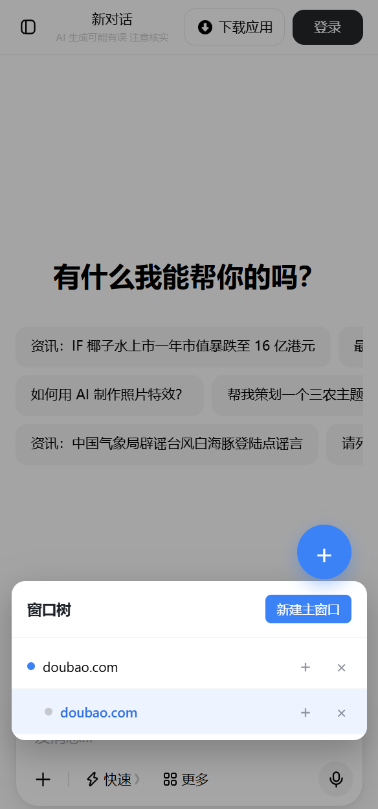

# 嵌入看板（Embedded Dashboard）

响应式多窗口网页嵌入应用：PC 端是「主窗口 + 右侧小窗口 + 拖拽脱离/resize/snapback」的桌面模式；移动端（H5）是「全屏 iframe + 悬浮按钮 + 窗口树」模式。两种模式按窗口宽度自动切换（断点 768px），状态独立、互不干扰。

## 解决的问题

在使用 AI 网页问答时，常需要对某一个点产生疑问，需要立即在另一个窗口打开参考页面。PC 端用分屏布局解决，但移动端屏幕太小，分屏不可读 — H5 用「窗口树 + 全屏切换」替代。

## 截图预览

### PC 首页（home）


### PC 拖动后的效果（move）


### H5 应用（h5）



## 功能列表

### PC 桌面模式（≥ 768px）

| 功能 | 操作 |
|---|---|
| 加载主窗口网址 | 左侧顶部输入框输入 URL，点「加载」或按 Enter |
| 清空主窗口 | 点「清空」按钮 |
| 添加右侧小窗口 | 右侧顶部 `+` 按钮，输入 URL；或点击预设网址 |
| 脱离右侧布局 | 按住小窗口标题栏拖动（超过 4px 自动脱离） |
| 移动浮动窗口 | 拖动浮动窗口标题栏 |
| 调整浮动窗口大小 | 拖动右下角斜纹手柄 |
| 回归右侧布局 | 浮动窗口点 `↩` 或右键标题栏 |
| 关闭窗口 | 点 `×` 按钮 |
| 调整左右比例 | 拖动中间分隔条（5%–95%，默认 7:3） |

### H5 模式（< 768px）

| 功能 | 操作 |
|---|---|
| 打开主网页 | 无窗口时输入网址点「打开」 |
| 新建主窗口（替换） | FAB → 新建主窗口 → 输入网址 → 已有主窗口会被替换 |
| 新建子窗口 | FAB → 节点右侧「＋」 → 可填标题 + 网址 |
| 切换窗口 | FAB → 点节点行 |
| 关闭窗口 | FAB → 节点右侧「×」（连同所有子节点一起关闭） |
| 拖动 FAB | 长按 + 按钮拖动到任意位置，松开保存 |
| 持久化 | 节点树存 localStorage（`cw_nodes`），刷新后恢复 |

## 技术栈

- **Vue 3** — 组合式 API（`<script setup>`）
- **Vite 5** — 开发服务器 + 打包
- **原生 CSS** — scoped styles，无 UI 库依赖
- **Pointer Events API + setPointerCapture** — 拖动事件处理（PC 拖拽脱离 / H5 FAB 拖动）

## 项目启动步骤

### 1. 安装依赖

```bash
npm install
```

### 2. 启动开发服务器

```bash
npm run dev
```

启动后浏览器打开 http://localhost:5173/。PC 直接用，H5 调试建议 Chrome DevTools 切到手机模式。

### 3. 构建生产版本

```bash
npm run build
```

构建产物在 `dist/` 目录，可部署到任何静态托管。

### 4. 预览生产版本

```bash
npm run preview
```

## 目录结构

```
cw/
├── package.json
├── vite.config.js
├── index.html
├── README.md
└── src/
    ├── main.js                    # 应用入口
    ├── styles.css                 # 全局样式
    ├── App.vue                    # 根组件：响应式分支 + 两套独立状态
    └── components/
        ├── MainWindow.vue         # PC：主窗口（URL 输入 + iframe）
        ├── RightPanel.vue         # PC：右侧小窗口面板 + 拖拽脱离
        ├── EmbeddedWindow.vue     # PC：浮动窗口（拖动 / resize / snapback）
        └── FabTree.vue            # H5：悬浮按钮 + 树形窗口列表
```

## 使用说明

### PC 桌面模式

1. **加载主窗口**：左侧顶部输入框粘贴网址（如 `https://claude.ai`），点「加载」。
2. **添加右侧小窗口**：右侧 `+` 按钮，输入 URL；或点击预设网址（Google/MDN/GitHub/SO/Bing/Wikipedia）。
3. **脱离布局**：按住小窗口标题栏拖动超过 4px → 变浮动窗口，可全页面拖动 + resize。
4. **回归布局**：浮动窗口 `↩` 按钮或右键标题栏 → 回到右侧布局，剩余窗口重新均分。
5. **调整比例**：拖动主窗口和右侧之间的灰色分隔条。

### H5 模式

1. **打开主网页**：进入应用，输入框粘贴网址，点「打开」。窗口全屏铺满。
2. **新建主窗口（替换）**：点悬浮按钮 `+` → 树列表顶部「新建主窗口」 → 输入网址 → 「打开」。**注意：树只有一个根，新建主窗口会替换现有主窗口的网址**，子窗口保留。
3. **新建子窗口**：点悬浮按钮 → 节点行右侧「＋」 → 可填标题（留空用网址 hostname）和网址 → 「打开」。子窗口挂在该节点下，全屏显示。
4. **切换窗口**：点悬浮按钮 → 点列表中任意节点行，立即切换。
5. **关闭窗口**：节点行右侧「×」，该节点连同所有子节点一起删除。
6. **拖动 FAB**：长按 `+` 按钮拖动到任意位置，松开保存，刷新后保留。
7. **持久化**：节点树存 localStorage（`cw_nodes`），刷新后恢复。

## 关键技术点

### 响应式分支

App.vue 顶部 `isMobile` ref 监听 `window.innerWidth < 768`，`<template v-if="!isMobile">` 走 PC 三件套，`v-else` 走 H5 全屏 + FabTree。两套状态模型独立（PC 用 `leftUrl/windows`，H5 用 `nodes/childrenOf/activeId`），localStorage key 也不同（`cw_leftUrl` vs `cw_nodes`），切换设备宽度互不干扰。

### 拖动事件：Pointer Events + setPointerCapture

iframe 会吞掉普通的 `mouseup` 事件，导致拖动停不下来。PC 桌面拖拽脱离、H5 FAB 拖动都用：

- `pointerdown` / `pointermove` / `pointerup` / `pointercancel` 替代 mouse 事件
- 拖动开始时调用 `setPointerCapture(pointerId)`，所有后续指针事件直接派发到捕获元素，iframe 不可能再吞掉 `pointerup`
- 拖动元素加 `touch-action: none`，防止触屏滚动抢占

### 窗口模式切换（PC）

每个小窗口两种模式：`snapped`（在右侧布局按比例均分高度）/ `floating`（脱离布局自由移动 + resize）。拖动 snapped 标题栏超过 4px 阈值 → 自动转 floating；点 `↩` 或右键 → 转回 snapped。

### z-index 层级（PC）

- 主窗口、右侧面板：默认层级
- 浮动窗口容器（`.floating-layer`）：`z-index: 9999`，永远在最上层
- 浮动窗口之间：点击或拖动时 `z` 值递增（从 100 起）

### 移动端适配（H5）

- viewport 加 `maximum-scale=1, user-scalable=no, viewport-fit=cover`，禁止双击缩放
- 全局样式重置 `-webkit-tap-highlight-color`，按钮无 300ms 延迟
- 输入框/按钮高度 ≥ 42px，符合移动端可点击区域规范

## 已知限制

### 1. CSP / X-Frame-Options 跨域拦截

部分网站（如 Google、GitHub、通义千问 `qianwen.com`、淘宝等）通过 `Content-Security-Policy: frame-ancestors` / `X-Frame-Options` 响应头拦截 iframe 嵌入，浏览器会报 `Refused to display in a frame` 错误。这是站点策略，不是代码问题。

**PC 浏览器** 可通过安装插件（如 [Ignore X-Frame-Options](https://chromewebstore.google.com/detail/ignore-x-frame-options/bkdbbopncdjmdcofliccdlljdcengckm) 等，或类似 Disable-CSP 的插件临时关闭同源策略）剥离响应头来绕过；项目也内置了 `server/proxy.js` 本地反代（`npm run proxy`），通过代理路径 `http://localhost:8788/proxy?url=<目标>` 加载可剥离 CSP 头。

**手机浏览器** CSP 执行更严格，且**没有对应插件**可关闭，因此 H5 模式下被 CSP 拦截的站点会**直接显示空白或浏览器错误页**，无有效绕过方式。建议 H5 模式只嵌入允许 iframe 的站点（如 MDN、Wikipedia、Bing、自建内部工具等），或在自己可控的 App WebView 容器里调整 CSP 策略。

### 2. 登录态/鉴权站点

iframe 不携带父页面的 cookie，需要登录的站点（如 GitHub 私有页、Google 账号）会跳出登录页或功能受限。

### 3. 沙箱限制

iframe 加了 `sandbox` 属性，限制部分权限（如同源脚本访问），如某些网站功能异常可调整 sandbox 配置。

### 4. iOS Safari 限制

iOS Safari 对 iframe 内的某些交互（如视频自动播放、地理位置）有额外限制，可能需要原生 App 容器。

## 社区认可

web-multiple-view 认可并感谢 [linuxdo](https://linux.do/) 社区及佬友们对开源交流、软件开发和项目成长提供的支持。
